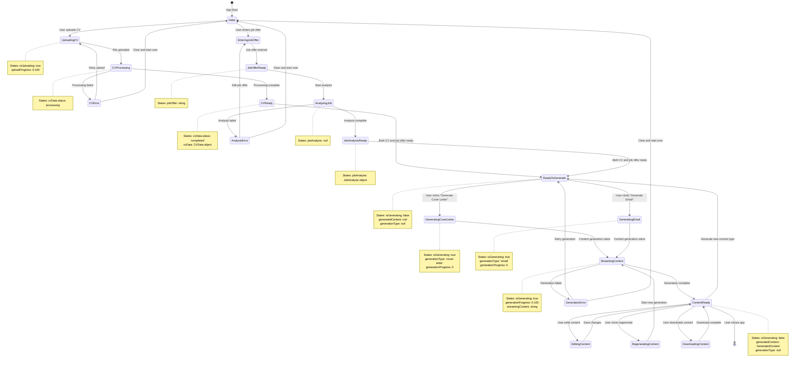

# Generator Display State Machine

This document describes the state machine for the content generator display in the JobBooster application.

## State Machine Diagram

## State Descriptions

### Initial State
- **Description**: Application startup state
- **Conditions**: No CV data, no job offer
- **UI**: Shows upload form and job offer input

### Upload States
- **UploadingCV**: User is uploading a CV file
- **CVProcessing**: CV file is being processed
- **CVReady**: CV processing completed successfully
- **CVError**: CV processing failed

### Job Offer States
- **EnteringJobOffer**: User is entering job offer text
- **JobOfferReady**: Job offer text is ready
- **AnalyzingJob**: Job offer is being analyzed
- **JobAnalysisReady**: Job analysis completed
- **AnalysisError**: Job analysis failed

### Generation States
- **ReadyToGenerate**: Both CV and job offer are ready for content generation
- **GeneratingCoverLetter**: Generating a cover letter
- **GeneratingEmail**: Generating an email
- **StreamingContent**: Content is being streamed to the UI
- **ContentReady**: Content generation completed

### Content Management States
- **EditingContent**: User is editing the generated content
- **RegeneratingContent**: User is regenerating content

## Key State Variables

### AppState Properties
- `cvData`: CVData | null - Current CV information
- `jobOffer`: string - Job offer text
- `jobAnalysis`: JobAnalysis | null - Analyzed job information
- `generatedContent`: GeneratedContent | null - Generated content
- `isGenerating`: boolean - Whether content is being generated
- `generationType`: 'cover-letter' | 'email' | null - Type of content being generated
- `generationProgress`: number - Progress of generation (0-100)
- `isUploading`: boolean - Whether CV is being uploaded
- `uploadProgress`: number - Progress of upload (0-100)
- `error`: string | null - Current error message

## Actions and Transitions

### Upload Actions
- `START_UPLOAD` → UploadingCV
- `SET_UPLOAD_PROGRESS` → Updates upload progress
- `COMPLETE_UPLOAD` → CVProcessing
- `SET_CV_DATA` → CVReady
- `CLEAR_CV_DATA` → Initial

### Job Offer Actions
- `SET_JOB_OFFER` → JobOfferReady
- `CLEAR_JOB_OFFER` → Initial
- `SET_JOB_ANALYSIS` → JobAnalysisReady

### Generation Actions
- `START_GENERATION` → GeneratingCoverLetter/GeneratingEmail
- `SET_GENERATION_PROGRESS` → Updates generation progress
- `SET_GENERATED_CONTENT` → ContentReady
- `STOP_GENERATION` → ReadyToGenerate
- `CLEAR_GENERATED_CONTENT` → ReadyToGenerate

### Error Handling
- `SET_ERROR` → Error states
- `CLEAR_ERROR` → Previous valid state

## Error States and Recovery

The state machine includes error handling for:
1. **CV Processing Errors**: User can retry upload or start over
2. **Job Analysis Errors**: User can edit job offer or start over
3. **Generation Errors**: User can retry generation or start over

Each error state provides clear recovery paths back to functional states.
